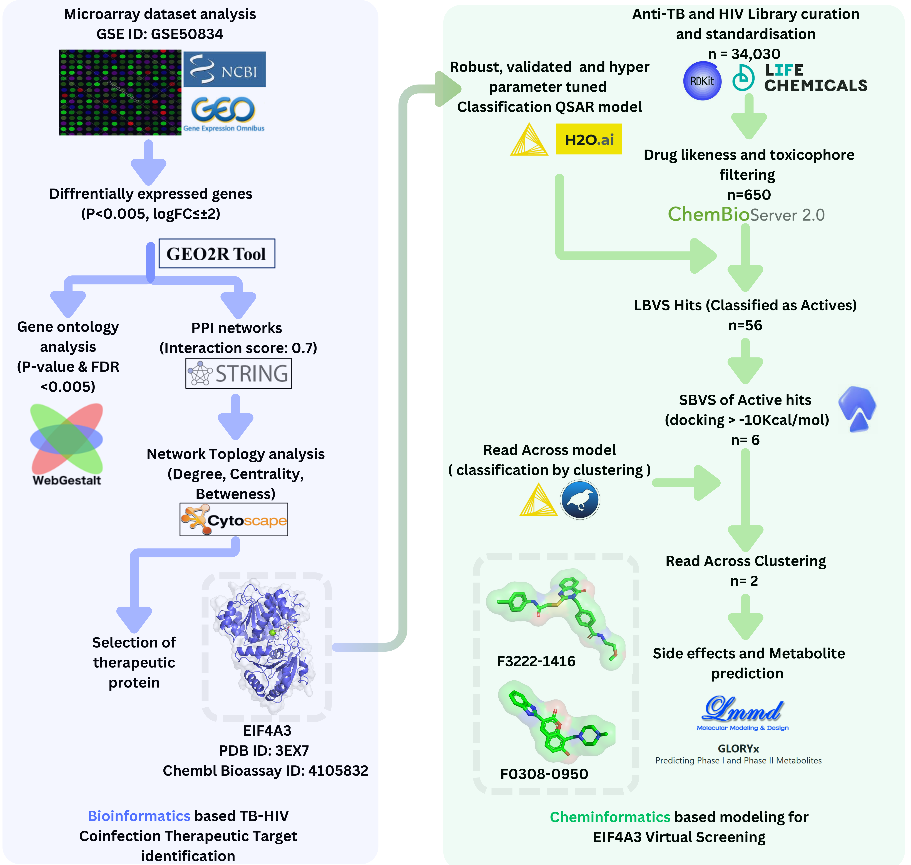

Keywords: TB/HIV, Coinfection, Microarray analysis, Network biology, QSAR-ML, Virtual screening, molecular docking.

Identification of therapeutic target through micro-array dataset for TB-HIV coinfection state. THe identified target was explored through cheminformatics and amchine learning to idnetify potent inhibitors to modulate the coinfection state.

